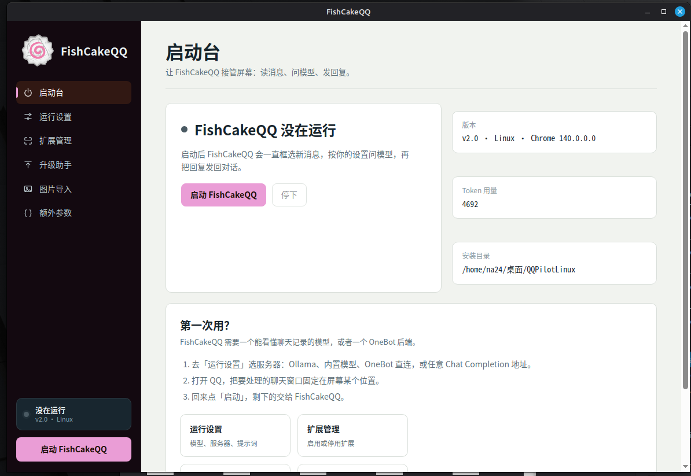

# 图形界面

[← 返回目录](main.md)

FishCakeQQ 的设置、扩展管理、升级、图片导入等整合在**一个网页界面**里，由
[pywebview](https://pywebview.flowrl.com/) 渲染：

```bash
./menu.sh        # 等价于 uv run menu.py
```

---

## 为什么是网页

原先这些功能由 6 个独立的 tkinter 窗口提供，风格与维护成本都不理想。
现在它们合并为一个窗口：左侧是导航栏，右侧是内容区，底部状态与提示统一处理。
界面源码在 `webui/`：

| 路径 | 作用 |
|------|------|
| `webui/app.py` | pywebview 宿主 + Python↔JS 桥（读写配置、扩展、升级、图片等） |
| `webui/web/index.html` | 界面骨架 |
| `webui/web/style.css` | 样式 |
| `webui/web/app.js` | 交互逻辑 |

> Python 与前端通过 `window.pywebview.api.*` 通信；耗时任务（升级、复制图片）
> 会通过事件把进度推回界面。

---

## 页面一览

### 启动台
- 查看运行状态、版本、平台、Token 用量、安装目录。
- **启动 / 停止** 机器人（等价于 `run.sh`）。
- 首次使用的三步引导。

### 运行设置
把 `config.ini` 的所有字段按类别整理成表单：

- **身份**：用户名（判断是否是自己发的消息）
- **运行**：窗口尺寸、框选时长、Tab 次数、解析图片数、发送图片概率、
  自动登录、持续置前、包含图片、只检查 @
- **模型与服务器**：模型名、视觉模型、服务器类型、API Key、超时、
  OneBot 的 WebSocket 地址 / 账号 / 正反向
- **提示词**：`system`，以及 `extra.json` 的入口

保存时会做校验（数字、概率范围、必填项），错误会直接标在对应字段下方。

### 扩展管理
- 列出 `Extensions/` 下的所有扩展及其描述。
- 一键 **启用 / 停用**（本质是把文件在 `.py` ↔ `.disabled` 之间改名）。
- 「打开目录」用系统文件管理器打开扩展目录。

### 升级助手
- 把当前目录的代码复制到目标安装目录。
- 目标已存在的 `config.ini` 会被**合并**（保留目标里已有的值），
  `system.txt` / `extra.json` 等个人配置默认保留。
- 复制、合并过程实时显示在日志区。

### 图片导入
- 选择源文件夹，把其中的图片批量复制到程序的 `Images/`。
- 支持 jpg / png / gif / bmp / webp / tiff / svg，同名文件会被覆盖。

### 额外参数
- 编辑 `extra.json`，保存前校验 JSON。
- 「格式化」按钮可一键整理缩进。

---

## 后端要求

Linux 上 pywebview 需要一个 WebView 后端。项目依赖里已经包含 `pywebview[qt]`：

```bash
uv sync     # 会自动装好 Qt 后端
```

若仍打不开界面，可补装 Qt 的运行库：

```bash
sudo apt install libnss3 libxkbcommon-x11-0 libxcb-cursor0
```

或者改用 GTK 后端：

```bash
sudo apt install gir1.2-webkit2-4.1 python3-gi
uv pip install "pywebview[gtk]"
```

详见 [排错指南](troubleshooting.md)。

---

## 语言

界面文案全部走本地化，语言由 `config.ini` 的 `language` 决定；
启动界面时会把整张翻译表交给前端，缺翻译会显示成 `X<key>`。
具体见 [本地化](localization.md)。

---

## 与命令行脚本的关系

`menu.sh` 只是 `uv run menu.py` 的快捷方式；界面里的「启动」按钮执行的是
项目目录下的 `run.sh`。也就是说界面与命令行**没有功能差异**，
你可以只用命令行，也可以只用界面。

[← 返回目录](main.md)
